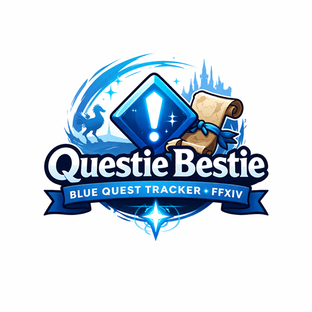

  

<h1 align="center">QuestieBestie</h1>

<b>Blue Quest Tracker for FFXIV</b> Track unlocks, plan your route, never miss a feature.

---

## Features

- Browse all blue (feature unlock) quests with filters for expansion, class, location, type, and level
- See what each quest unlocks — dungeons, trials, raids, jobs, and 200+ more
- Prerequisite trees with MSQ indicators
- Custom tracking lists with in-game overlay and route planner
- Aether Current tracker, Duty Unlock checklist, Side Quest browser
- Statistics per expansion and type
- Favorites, personal notes, map flags, chat links
- Customizable overlay and compact progress widget
- Optional dark theme (respects your Dalamud style by default)
- Multi-language: English, German, French, Japanese

## Tabs

| Tab | What it shows |
|-----|---------------|
| Quests | Full quest database with sorting, filters, and bulk actions |
| Aether Currents | Per-zone progress bars |
| Duty Unlocks | Dungeons, Trials, Raids grouped by category |
| Side Quests | Yellow quests with special tags (emotes, beast tribes, prerequisites) |
| Recent | Last 20 viewed quests |
| Statistics | Completion progress overall, per expansion, and per type |

## Commands

| Command | Description |
|---------|-------------|
| `/questie` | Toggle main window |
| `/questie overlay` | Toggle overlay |
| `/questie widget` | Toggle progress widget |
| `/questie search <name>` | Search and open quest on map |

## Quick Start

1. Open with `/questie` or click the DTR bar entry
2. Use "Available" filter to see quests you can pick up now
3. Click a quest to see it on the map
4. Right-click to add to a tracking list or send to chat
5. Open the overlay to track quests while playing

---

## Contact

- Discord: **666kk_**
- GitHub: [kk-triplesix](https://github.com/kk-triplesix)

## AI Disclaimer

This plugin was developed with the assistance of AI tools. The plugin icon was also generated using AI. All code has been reviewed, tested, and validated by the developer with the feedback of the dalamud reviewers.

## License

This project is provided as-is for personal use with FFXIV.
